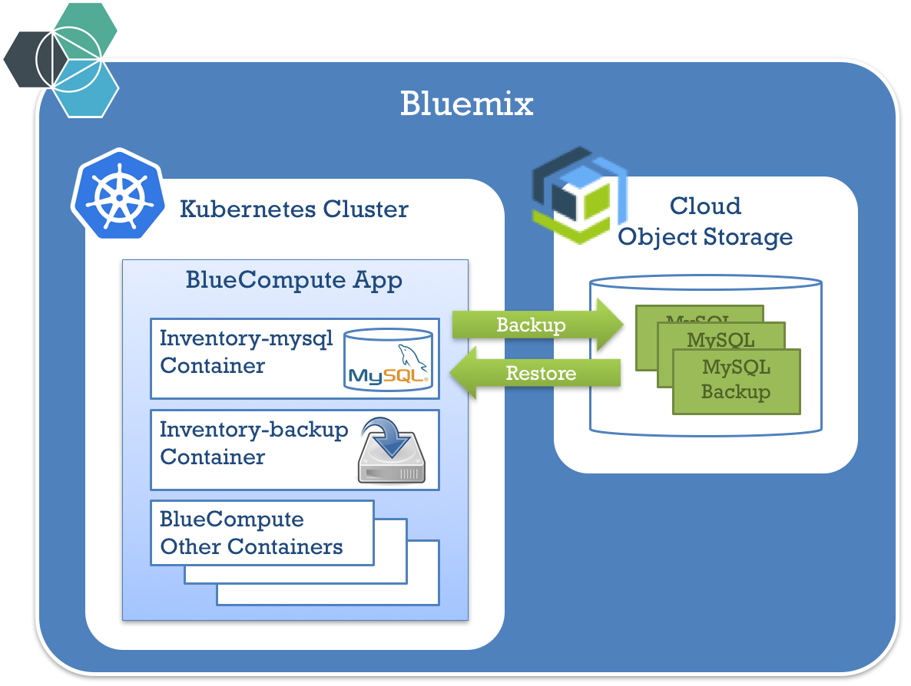
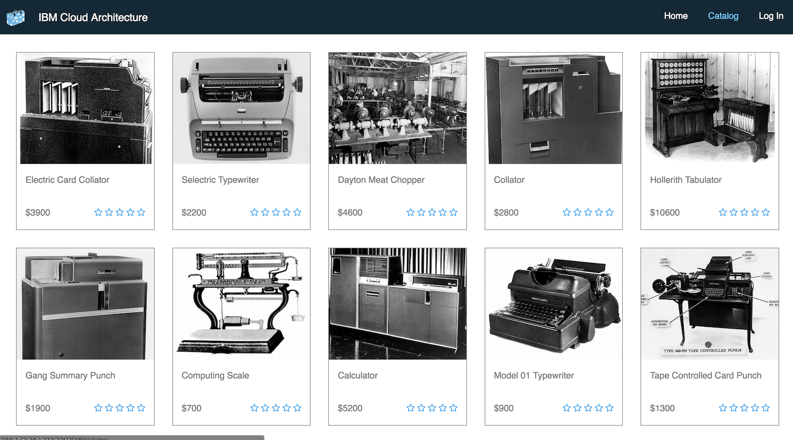
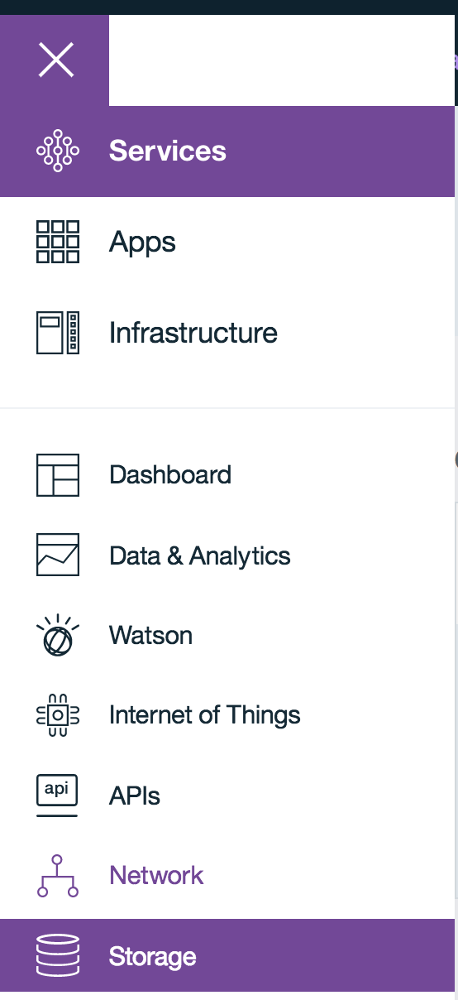
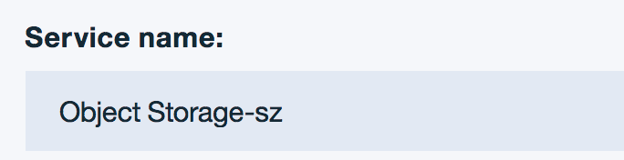
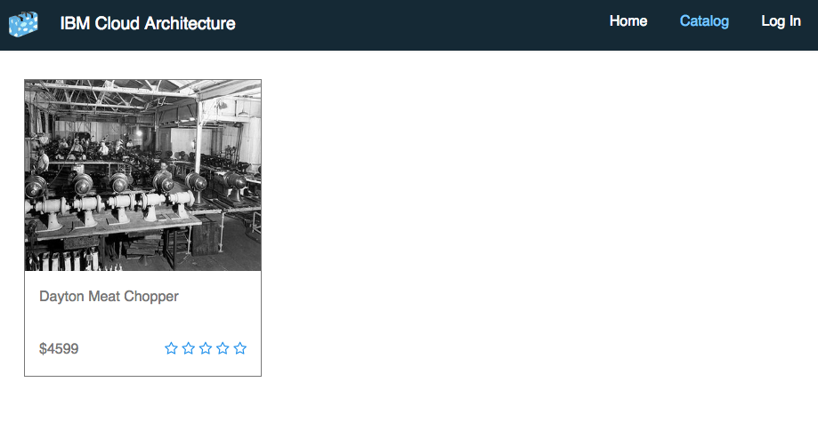

# Cloud Native Backup - Hands-On Lab

## Introduction

This project is a **hands-on lab** to demo how to **back up a cloud native application**.
For this lab we will add and test a [backup tool](https://console.bluemix.net/docs/images/docker_image_ibmbackup_restore/ibmbackup_restore_starter.html) to the inventory database of the [BlueCompute](https://github.com/ibm-cloud-architecture/refarch-cloudnative-kubernetes) reference application.

### Pre-requisites
* A [Kubernetes](https://kubernetes.io/) cluster
  * This hands-on lab has been tested with [Bluemix free Kubernetes cluster](https://console.bluemix.net/containers-kubernetes/launch)
* [Kubectl](https://kubernetes.io/docs/tasks/tools/install-kubectl/) command-line interface must be installed
  * For Bluemix Kubernetes Cluster, check this [documentation page](https://console.bluemix.net/docs/containers/cs_cli_install.html) if needed
* [Helm](https://kubernetes.io/docs/tasks/tools/install-kubectl/), the Kubernetes package manager, must be installed
  * Check this [installation page](https://github.com/kubernetes/helm/blob/master/docs/install.md) if needed

### Hands-on lab
The main steps of this lab are:
* configure object storage
* deploy the Bluecompute application
* do a backup of the inventory MySQL database to Cloud Object Storage 
* simulate a problem with MySQL data
* restore the MySQL data from Cloud Object Storage
* verify that the database data is correctly restored



## Deploy BlueCompute application
Follow the instructions on this project to deploy BlueCompute: 
[Deploy BlueCompute](https://github.com/ibm-cloud-architecture/refarch-cloudnative-kubernetes)

At the end, you will see the catalog with 12 items, including the ones displayed in the following screen:




## Configure Cloud Object Storage for backups

### Create a Cloud Object Storage account

Follow these steps to create a Cloud Object Storage account:

* Log on to Bluemix by going to [Bluemix](https://bluemix.net)

* In the upper left side, click the Menu area


* Select Service -> Storage



* Click *Create Storage service*

* Click *Object Storage*

* Change the Storage name



* Click *Create* in the lower right side


## Bind the Object Storage credentials to the Kubernetes cluster.

In the terminal, find the name of the Object Storage service

```bash
bx cf services | grep Object-Storage
```

Get the name of your Kubernetes cluster by running the following command:
```bash
bx cs clusters
```

Bind this Object Storage service to the cluster:

```bash
bx cs cluster-service-bind <cluster-name> default "<object storage service>"
```

For example, in my cluster `awesome-kube`, with my Object Storage service named `jkwong-objstorage`:

```bash
bx cs cluster-service-bind awesome-kube default jkwong-objstorage
```

Find the name of the created secret for object storage; the name should be similar to `binding-<service-name>`

```bash
kubectl get secrets
```

## Enable the backup on the MySQL container

Find the name of the chart used for the MySQL instance for Inventory Microservice:

```bash
helm list -q 'inventory-mysql'
```

Enable backup on this chart using the source chart stored in the [refarch-cloudnative-resiliency](https://github.com/ibm-cloud-architecture/refarch-cloudnative-resiliency/tree/kube-int) repository:

```bash
git clone https://github.com/ibm-cloud-architecture/refarch-cloudnative-resiliency.git
cd refarch-cloudnative-resiliency
git checkout kube-int
cd mysql/chart
```

Use the following command to enable the backup, 

* `<name of backup>` refers the container on the Object Storage service it will use to upload the data to
* `binding-<service-name>` is the name of the secrets (using the output of `kubectl get secrets` above)
* `<name of inventory release>` is the name of the release (as returned by `helm list -q 'inventory-mysql'`

```
helm upgrade \
  --reuse-values \
  --set mysql.backup.enabled=true \
  --set mysql.backup.backupName=<name of backup> \
  --set mysql.backup.objStoreSecretName=binding-<service-name>
  <name of inventory release> \
  ibmcase-mysql
```

This command adds a backup container that performs the daily incremental backup against the `/var/lib/mysql` directory where all of the MySQL data is stored.

## Simulate a failure

### Remove database records

Run the following steps to simulate a database corruption:

* Find the MySQL POD:

```bash
export MYSQL_ID=`kubectl get po |grep mysql|awk '{print $1}'`
```

* Open an SSH connection to the MySQL POD:

```bash
kubectl exec -it $MYSQL_ID -- /bin/bash
```

You should see your MySQL container prompt:
```
root@inventory-mysql-1346511112-235wj:/#
```

* Type the following command:
```bash
mysql --user dbuser inventorydb --password
```
then type "password" as the password

* In the MySQL prompt, type the following command to list the item IDs:

```
select id from items;
```

You will see the following result:
```
+-------+
| id    |
+-------+
| 13401 |
| 13402 |
| 13403 |
| 13404 |
| 13405 |
| 13406 |
| 13407 |
| 13408 |
| 13409 |
| 13410 |
| 13411 |
| 13412 |
+-------+
12 rows in set (0.00 sec)
```

* Now, in the MySQL prompt, delete all the records except one:

```
delete from items where id != 13401;
```

You should see the following result:

```
Query OK, 11 rows affected (0.04 sec)
```

Exit the MySQL prompt by typing

```
quit
```

Then exit the container shell

```bash
exit
```

### Refresh cache

Now the database records are cached in ElasticSearch, so we need to destroy the ElasticSearch POD in order to refresh the data.

* Run the following command to obtain the ElasticSearch and Inventory PODs:

```bash
export ES_ID=`kubectl get po |grep elasticsearch|awk '{print $1}'`&
export INV_ID=`kubectl get po |grep inventory-ce|awk '{print $1}'`
```

* Now destroy the ElasticSearch and Inventory PODs:

```bash
kubectl delete po $ES_ID $INV_ID
```

* After a few seconds, you'll see that Kubernetes starts another ElasticSearch POD automatically:

```
eduardos-mbp:refarch-cloudnative-kubernetes edu$ kubectl get po
NAME                                            READY     STATUS             RESTARTS   AGE
bluecompute-auth-3701940813-6r3w8               1/1       Running            0          6m
bluecompute-customer-1247026218-kmsz8           1/1       Running            0          8m
bluecompute-customer-couchdb-1485455251-c29b0   1/1       Running            0          8m
bluecompute-web-deployment-1763171077-d7zq6     1/1       Running            0          5m
catalog-ce-2251916216-hgs74                     1/1       Running            0          5m
catalog-elasticsearch-1g8wm                     1/1       Terminating        0          8m
catalog-elasticsearch-mnq2w                     1/1       Running            0          19s
inventory-ce-614843698-0f8fz                    0/1       CrashLoopBackOff   5          6m
inventory-mysql-3976943720-ftfv4                2/2       Running            0          8m

```

After a few minutes, you'll see that the BlueCompute Web UI has now a single item in the catalog.




## TODO Restore

Follow these instrutions to restore the backup. 

* Stop the MySQL container, by reducing the number of pods to 0
```bash
kubectl scale --replicas=0 deploy/inventory-mysql
```

* Connect to the Backup container
```bash
kubectl exec -it $BCK_ID bash
```

* Run the following command:
```bash
./vrestore
```

You will see the following output:
```
[2017-06-20 18:15:21,209] [utilities : 151] [INFO] *****************Start logging to ./Restore.log
[2017-06-20 18:15:21,209] [restore : 28] [INFO] Starting the restore process.
[2017-06-20 18:15:21,209] [configureOS : 22] [INFO] Configuring duplicity with IBM Bluemix ObjectStorage.
[2017-06-20 18:15:21,209] [configureOS : 13] [INFO] Configuring swift client.
[2017-06-20 18:15:21,210] [restore : 40] [INFO] Configuration is completed.
[2017-06-20 18:15:27,839] [restore : 70] [INFO] Restoring the backup that is named 'patrocinio-inventory-mysql' is completed. Local and Remote metadata are synchronized, no sync needed.
```

Exit the container by typing
```bash
exit
```

* Restart the MySQL container, by increasing the number of pods to 1:
```bash
kubectl scale --replicas=1 deploy/inventory-mysql
```

* Log on to the new MySQL container:

```bash
export MYSQL_ID=`kubectl get po |grep mysql|awk '{print $1}'`
kubectl exec -it $MYSQL_ID -- /bin/bash
```

You should see your MySQL container prompt:
```
root@inventory-mysql-1346511112-235wj:/#
```

* Type the following command:
```bash
mysql --user dbuser inventorydb --password
```
then type password as the pasword

* In the MySQL prompt, type the following command to list the item IDs:

```
select id from items;
```

You will see the following result:
```
+-------+
| id    |
+-------+
| 13401 |
| 13402 |
| 13403 |
| 13404 |
| 13405 |
| 13406 |
| 13407 |
| 13408 |
| 13409 |
| 13410 |
| 13411 |
| 13412 |
+-------+
12 rows in set (0.00 sec)
```

* Exit the MySQL prompt by typing `quit` then type `exit` to exit the container shell.

* Wait a few minutes and refresh the BlueCompute Web UI page. You'll see all the items back!
