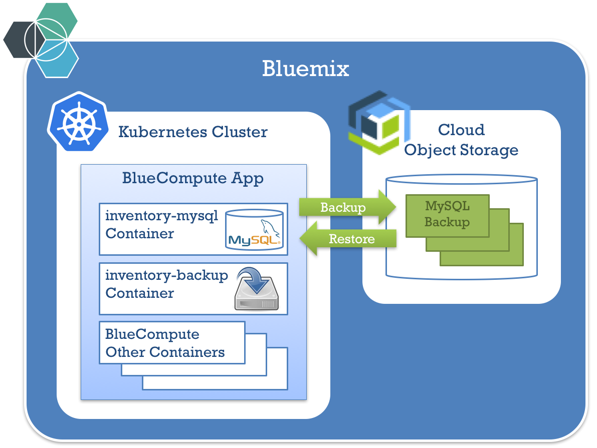
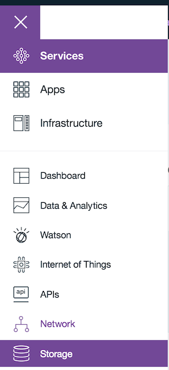
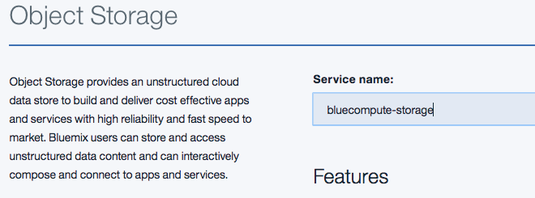

# Cloud Native Backup - Hands-On Lab

## Introduction

This project is a **hands-on lab** to demo how to **back up a cloud native application**.
For this lab we will add and test a [backup tool](https://console.bluemix.net/docs/images/docker_image_ibmbackup_restore/ibmbackup_restore_starter.html) to the inventory database of the [BlueCompute](https://github.com/ibm-cloud-architecture/refarch-cloudnative-kubernetes) reference application.

### Pre-requisites
* [Git](https://git-scm.com/book/en/v2/Getting-Started-Installing-Git), a version control system tool
* A [Kubernetes](https://kubernetes.io/) cluster
  * This hands-on lab has been tested with [Bluemix free Kubernetes cluster](https://console.bluemix.net/containers-kubernetes/launch)
* [Kubectl](https://kubernetes.io/docs/tasks/tools/install-kubectl/) command-line interface must be installed
  * For Bluemix Kubernetes Cluster, check this [documentation page](https://console.bluemix.net/docs/containers/cs_cli_install.html) if needed
* [Helm](https://kubernetes.io/docs/tasks/tools/install-kubectl/), the Kubernetes package manager, must be installed
  * Check this [installation page](https://github.com/kubernetes/helm/blob/master/docs/install.md) if needed

### Summary of the hands-on labs steps
The main steps of this lab are:
1. deploy the Bluecompute application
2. configure Cloud Object Storage for backups
3. do a backup of the inventory MySQL database to Cloud Object Storage 
4. simulate a problem with MySQL data
5. restore the MySQL data from Cloud Object Storage
6. verify that the database data is correctly restored



## 1 - Deploy the BlueCompute application
Follow the instructions on this project to deploy BlueCompute: 
[Deploy BlueCompute](https://github.com/ibm-cloud-architecture/refarch-cloudnative-kubernetes)

When the deployment, you should be able to access BlueCompute web page and see the catalog with 12 items, including the ones displayed in the following screen:


## 2 - Configure Cloud Object Storage for backups

### Create a Cloud Object Storage account

Follow these steps to create a Cloud Object Storage account:

* Log on to Bluemix by going to [Bluemix](https://bluemix.net)
* If you are not using US region, switch to "US South" in the top menu
* In the upper left side, click the Menu area

  

* Select Service -> Storage

  

* Click *Create Storage service*

* Click *Object Storage*

* Change the Storage name



* Click *Create* in the lower right side


## Bind the Object Storage credentials to the Kubernetes cluster.

In the terminal, find the name of the Object Storage service

```bash
bx cf services | grep Object-Storage
```

Get the name of your Kubernetes cluster by running the following command:
```bash
bx cs clusters
```

Bind this Object Storage service to the cluster:

```bash
bx cs cluster-service-bind <cluster-name> default "<object storage service>"
```

For example, in my cluster `awesome-kube`, with my Object Storage service named `jkwong-objstorage`:

```bash
bx cs cluster-service-bind awesome-kube default jkwong-objstorage
```

Find the name of the created secret for object storage; the name should be similar to `binding-<service-name>`

```bash
kubectl get secrets
```

## Enable the backup on the MySQL container

Find the name of the chart used for the MySQL instance for Inventory Microservice:

```bash
helm list -q 'inventory-mysql'
```

Enable backup on this chart using the source chart stored in the [refarch-cloudnative-resiliency](https://github.com/ibm-cloud-architecture/refarch-cloudnative-resiliency/tree/kube-int) repository:

```bash
git clone https://github.com/ibm-cloud-architecture/refarch-cloudnative-resiliency.git
cd refarch-cloudnative-resiliency
git checkout kube-int
cd mysql/chart
```

Use the following command to enable the backup, 

* `<name of backup>` refers the container on the Object Storage service it will use to upload the data to
* `binding-<service-name>` is the name of the secrets (using the output of `kubectl get secrets` above)
* `<name of inventory release>` is the name of the release (as returned by `helm list -q 'inventory-mysql'`

```
helm upgrade \
  --reuse-values \
  --set mysql.backup.enabled=true \
  --set mysql.backup.backupName=<name of backup> \
  --set mysql.backup.objStoreSecretName=binding-<service-name>
  <name of inventory release> \
  ibmcase-mysql
```

This command adds a backup container that performs the daily incremental backup against the `/var/lib/mysql` directory where all of the MySQL data is stored.

You can validate that the backup container has been created by checking the number of containers in the inventory-mysql POD:

```bash
kubectl get po | grep inventory-mysql
```

You will see the following result:

```bash
eduardos-mbp:refarch-cloudnative-kubernetes edu$ kubectl get po | grep inventory-mysql
default-inventory-mysql-ibmcase-mysql-4154021736-qh5l7   2/2       Running   0          5m
```

Check the logs of the backup container to ensure that the backup has completed.

```bash
kubectl logs $(kubectl get po | grep inventory-mysql | awk '{print $1;}') -c inventory-backup-container
```

The backup completes when you see output similar to the following:

```
[2017-06-22 16:58:52,227] [backup : 102] [INFO] Backup done SUCCESSFULLY!!!!
```

## Simulate a failure

### Remove database records

Run the following steps to simulate a database corruption:

* Find the MySQL POD:

  ```bash
  export MYSQL_ID=`kubectl get po |grep mysql|awk '{print $1}'`
  ```

* Open an SSH connection to the MySQL POD:

  ```bash
  kubectl exec -it $MYSQL_ID -- /bin/bash
  ```

  You should see your MySQL container prompt:
  ```
  root@inventory-mysql-1346511112-235wj:/#
  ```

* Type the following command:

  ```bash
  mysql --u${MYSQL_USER} -p${MYSQL_PASSWORD} inventorydb
  ```

* In the MySQL prompt, type the following command to list the item IDs:

  ```mysql
  select id from items;
  ```

  You will see the following result:

  ```mysql
  +-------+
  | id    |
  +-------+
  | 13401 |
  | 13402 |
  | 13403 |
  | 13404 |
  | 13405 |
  | 13406 |
  | 13407 |
  | 13408 |
  | 13409 |
  | 13410 |
  | 13411 |
  | 13412 |
  +-------+
  12 rows in set (0.00 sec)
  ```

* Now, in the MySQL prompt, delete all the records except one:

  ```mysql
  delete from items where id != 13401;
  ```

  You should see the following result:

  ```mysql
  Query OK, 11 rows affected (0.04 sec)
  ```

  Exit the MySQL prompt by typing

  ```mysql
  quit
  ```

  Then exit the container shell

  ```bash
  exit
  ```

### Refresh cache

Now the database records are cached in ElasticSearch, so we need to destroy the ElasticSearch POD in order to refresh the data.

* Run the following command to obtain the ElasticSearch and Inventory PODs:

  ```bash
  export ES_ID=`kubectl get po |grep elasticsearch|awk '{print $1}'`
  export INV_ID=`kubectl get po |grep inventory-ce|awk '{print $1}'`
  ```

* Now destroy the ElasticSearch and Inventory PODs:

  ```bash
  kubectl delete po $ES_ID $INV_ID
  ```

* After a few seconds, you'll see that Kubernetes starts another ElasticSearch POD automatically:

  ```bash
  # kubectl get po
  NAME                                            READY     STATUS             RESTARTS   AGE
  bluecompute-auth-3701940813-6r3w8               1/1       Running            0          6m
  bluecompute-customer-1247026218-kmsz8           1/1       Running            0          8m
  bluecompute-customer-couchdb-1485455251-c29b0   1/1       Running            0          8m
  bluecompute-web-deployment-1763171077-d7zq6     1/1       Running            0          5m
  catalog-ce-2251916216-hgs74                     1/1       Running            0          5m
  catalog-elasticsearch-1g8wm                     1/1       Terminating        0          8m
  catalog-elasticsearch-mnq2w                     1/1       Running            0          19s
  inventory-ce-614843698-0f8fz                    0/1       CrashLoopBackOff   5          6m
  inventory-mysql-3976943720-ftfv4                2/2       Running            0          8m

  ```

  After a few minutes, you'll see that the BlueCompute Web UI has now a single item in the catalog.

  

## Restore

Follow these instructions to restore the backup. 

* Stop the MySQL container, by reducing the number of pods to 0

  ```bash
  kubectl scale --replicas=0 deploy/default-inventory-mysql-ibmcase-mysql
  ```
  
  Ensure that the MySQL container has stopped:
  
  ```bash
  kubectl get deployments | grep default-inventory-mysql
  default-inventory-mysql-ibmcase-mysql      0         0         0            0           1h
  ```

* Clone this git repository, if you haven't done so yet.

  ```bash
  git clone https://github.com/ibm-cloud-architecture/refarch-cloudnative-backup.git
  ```
  
  Switch to the `chart` directory:
  
  ```bash
  cd refarch-cloudnative-backup/chart
  ```

* Install the chart, which starts a job that restores the backup from object storage.  Substitute the following:

  * `<name of inventory MySQL release>`: the name of the release in helm.  This can be retrieved with
  
    ```bash
    helm list -q 'inventory-mysql'
    ```
  * `<name of backup>`: the name of the backup container.  This must match what was used to start the backup command.
  * `<service-name>`: the name of the Object Storage service created.  This must match what was used to start the backup command.  You can usually find out the string to put here (including the `binding-` prefix) using:
  
    ```bash
    kubectl get secrets
    ```

  ```bash
  helm install \
  --set hostPath=/var/lib/mysql-<name of inventory MySQL release> \
  --set objectStorage.backupName=<name of backup> \
  --set objectStorage.secretName=binding-<service-name>
  ibmcase-restore
  ```

* A Job will be created.
  
  ```bash
  # kubectl get jobs 
  NAME                                           DESIRED   SUCCESSFUL   AGE
  quoting-sparrow-ibmcase-restore-volume-jfilf   1         0            1m
  ```
  
  Get the pod associated with this job:
  
  ```bash
  # kubectl get pods -l job-name=quoting-sparrow-ibmcase-restore-volume-jfilf -a
  NAME                                                 READY     STATUS      RESTARTS   AGE
  quoting-sparrow-ibmcase-restore-volume-jfilf-g9280   1/1       Running     0          7m
  ```

  Look at the logs associated with the job:
  
  ```bash
  # kubectl logs quoting-sparrow-ibmcase-restore-volume-jfilf-g9280
  ```
  
  You will see similar to the following output:
  
  ```
  [2017-06-22 17:22:56,036] [utilities : 151] [INFO] *****************Start logging to ./Restore.log
  [2017-06-22 17:22:56,036] [restore : 28] [INFO] Starting the restore process.
  [2017-06-22 17:22:56,036] [configureOS : 22] [INFO] Configuring duplicity with IBM Bluemix ObjectStorage.
  [2017-06-22 17:22:56,036] [configureOS : 13] [INFO] Configuring swift client.
  [2017-06-22 17:22:56,036] [restore : 40] [INFO] Configuration is completed.
  [2017-06-22 17:24:27,887] [restore : 70] [INFO] Restoring the backup that is named 'jkwong-backup' is completed. Synchronizing remote metadata to local cache...
  Copying duplicity-full-signatures.20170622T134612Z.sigtar.gz to local cache.
  Copying duplicity-full.20170622T134612Z.manifest to local cache.
  Copying duplicity-inc.20170622T134612Z.to.20170622T154028Z.manifest to local cache.
  Copying duplicity-inc.20170622T154028Z.to.20170622T165832Z.manifest to local cache.
  Copying duplicity-new-signatures.20170622T134612Z.to.20170622T154028Z.sigtar.gz to local cache.
  Copying duplicity-new-signatures.20170622T154028Z.to.20170622T165832Z.sigtar.gz to local cache.
  Last full backup date: Thu Jun 22 13:46:12 2017
  ```
  
  When the job completes, the restore has completed.
  
  ```bash
  # kubectl get jobs 
  NAME                                           DESIRED   SUCCESSFUL   AGE
  quoting-sparrow-ibmcase-restore-volume-jfilf   1         1            11m
  ```

* Restart the MySQL container, by increasing the number of pods to 1:

  ```bash
  kubectl scale --replicas=1 deploy/default-inventory-mysql-ibmcase-mysql
  ```
  
  Wait until the new container has started, when `AVAILABLE` goes to `1`.
  
  ```bash
  # kubectl get deployments default-inventory-mysql-ibmcase-mysql
  NAME                                    DESIRED   CURRENT   UP-TO-DATE   AVAILABLE   AGE
  default-inventory-mysql-ibmcase-mysql   1         1         1            1           2h
  ```

* Log on to the new MySQL container:

  ```bash
  export MYSQL_ID=`kubectl get po |grep mysql|awk '{print $1}'`
  kubectl exec -it $MYSQL_ID -- /bin/bash
  ```

  You should see your MySQL container prompt:
  ```
  root@inventory-mysql-1346511112-235wj:/#
  ```

* Type the following command:

  ```bash
  mysql --u${MYSQL_USER} -p${MYSQL_PASSWORD} inventorydb 
  ```

  then type password as the password

* In the MySQL prompt, type the following command to list the item IDs:

  ```mysql
  select id from items;
  ```

  You will see the following result:
  
  ```mysql
  +-------+
  | id    |
  +-------+
  | 13401 |
  | 13402 |
  | 13403 |
  | 13404 |
  | 13405 |
  | 13406 |
  | 13407 |
  | 13408 |
  | 13409 |
  | 13410 |
  | 13411 |
  | 13412 |
  +-------+
  12 rows in set (0.00 sec)
  ```

* Exit the MySQL prompt by typing `quit` then type `exit` to exit the container shell.

Now the database records are cached in ElasticSearch, so we need to destroy the ElasticSearch POD in order to refresh the data.

* Run the following command to obtain the ElasticSearch and Inventory PODs:

  ```bash
  export ES_ID=`kubectl get po |grep elasticsearch|awk '{print $1}'`
  export INV_ID=`kubectl get po |grep inventory-ce|awk '{print $1}'`
  ```

* Now destroy the ElasticSearch and Inventory PODs:

  ```bash
  kubectl delete po $ES_ID $INV_ID
  ```

* After a few seconds, you'll see that Kubernetes starts another ElasticSearch POD automatically:

```bash
  # kubectl get po
NAME                                                     READY     STATUS        RESTARTS   AGE
bluecompute-auth-3257476579-58h5t                        1/1       Running       0          3h
bluecompute-customer-3427541376-9ljcv                    1/1       Running       0          3h
bluecompute-customer-couchdb-288703141-k07dx             1/1       Running       0          3h
bluecompute-web-deployment-1666637335-1481t              1/1       Running       0          3h
catalog-ce-1834124410-l7m6b                              1/1       Running       0          3h
catalog-elasticsearch-hcbrn                              1/1       Running       0          31s
catalog-elasticsearch-j25vq                              1/1       Terminating   0          3h
default-inventory-mysql-ibmcase-mysql-4154021736-zzs88   2/2       Running       0          24m
inventory-ce-1218757904-rvlsm                            1/1       Running       0          31s
nginx                                                    1/1       Running       0          1d
```

* Wait a few minutes and refresh the BlueCompute Web UI page. You'll see all the items back!
